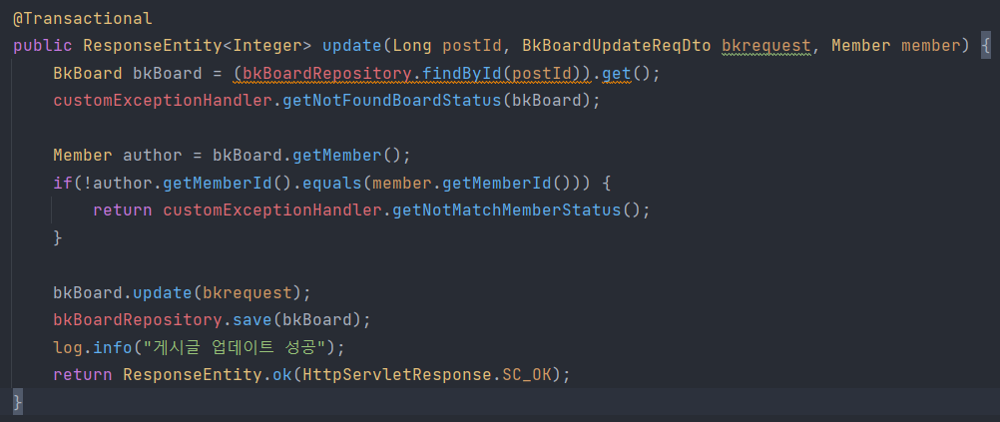
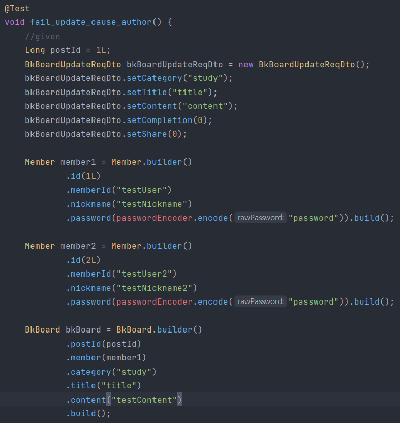
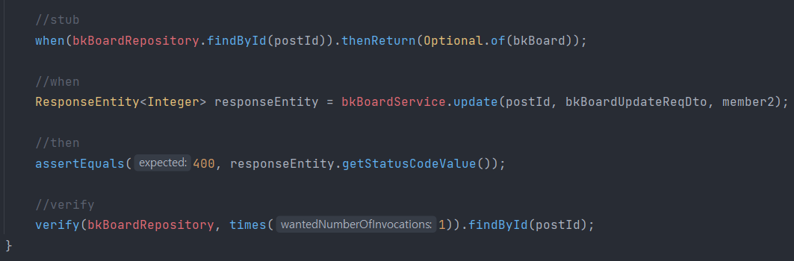
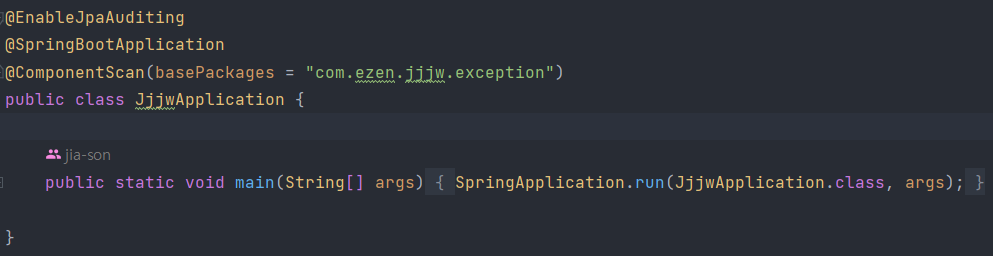
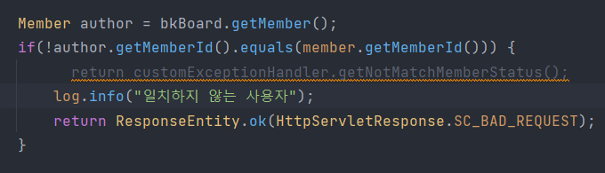
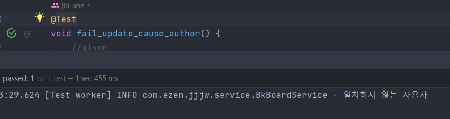

# Today? Tomorrow!
이젠 아카데미 프로젝트 Team.재정지원  
트러블 슈팅 정리

---
손지아 트러블 슈팅

 

1. BkBoardService 유닛 테스트 진행 도중 CustomExceptionHandler에 문제 발생

  
게시글 업데이트 메서드에 대해 테스트 코드를 작성하고 있었다.  
성공 케이스에서는 문제가 없었는데, 실패 케이스를 작성하던 중 when 부분의 값이 null로 반환되는 것을 확인할 수 있었다.  
테스트 코드 전문은 아래와 같다.  

  

디버깅을 해보니 서비스단에서 customExceptionHandler 의존성 주입이 되어 있지 않은 것이 확인되었다.  
서비스단에는 이미 @RequiredArgsConstructor 어노테이션이,  
CustomExceptionHandler 클래스에는 @Component 어노테이션이 있는 상태였다.  
실행 클래스에 @ComponentScan(basePackages = "com.ezen.jjjw.exception")를 붙여 다시 의존성을 주입해주었다.  

  
이후 테스트 코드를 재실행해봤으나...  
여전히 when 부분 responseEntity 값이 null로 뜨는 상황.  
customExceptionHandler에 아예 진입을 못하고 있기도 하고, 생각해보니 그 내부에서 뭔가 비교를 한다던지 검증을 하지 않는 코드였기 때문에 customExceptionHandler를 거치지 않고 바로 ResponseEntity.ok()를 리턴하도록 코드를 수정했다.

  
그 이후 테스트 결과는?

  
테스트 통과.  
왜 customExceptionHandler에 진입하지 못했던 건지, 어떻게 하면 진입하도록 할 수 있을지에 대해서는 추후 더 알아봐야겠다.

---

### CustomExceptionHandler 의존성 주입 문제

<strong>문제 상황</strong> :  
CustomExceptionHandler 의존성 주입이 안 되고 있어서 그 안에 있는 메서드에 진입하지를 못한다.

<strong>시도해본 해결법</strong> :  
1. 애플리케이션 클래스에 @ComponentScan 어노테이션 적용해보기
  > 권한이 필요하지 않은 경로(회원가입, 로그인 등) 요청에서 401 Unauthorized 에러 발생. 어노테이션 붙이기 전에는 없던 에러이다.  
  >> 시큐리티 설정한 부분에 권한 관련한 코드(authenticationEntryPointException)에서 걸리는 것으로 추정. 그런데 어노테이션을 붙이자마자 이렇게 되는 이유가 뭐지?

<strong>결론</strong> :  
CustomExceptionHandler에는 아무런 문제가 없었다.  
예외 처리를 하기 바로 윗 부분에 repository에서 게시글 객체를 찾는 부분이 있는데, 존재하지 않는 게시글을 꺼내려고 할 때 에러가 발생하며 애초에 메서드에 진입할 여지가 없던 것이었다.  
지금은 애초에 Optional<BkBoard> 객체로 꺼내온 후, 이후에 isPresent()를 사용해 안에 값이 존재하는지 그 여부를 따지는 것으로 수정했다.  
이미 처음과 같이 작성되어 있는 곳이 많이 있기 때문에 전체적으로 수정에 들어가야겠다.

2. BkBoardService 유닛 테스트 중 페이징 처리 테스트 관련

<strong>문제 상황 :</strong>  
테스트를 하며 member 객체에 List<BkBoard>값을 넣어주었음에도 불구하고 bkBoardPage 값이 null로 반환되는 상황

